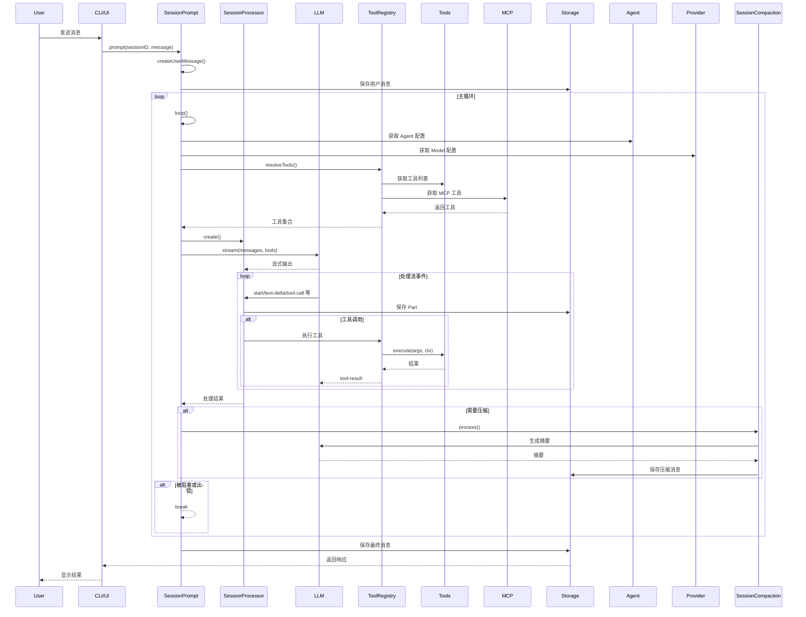
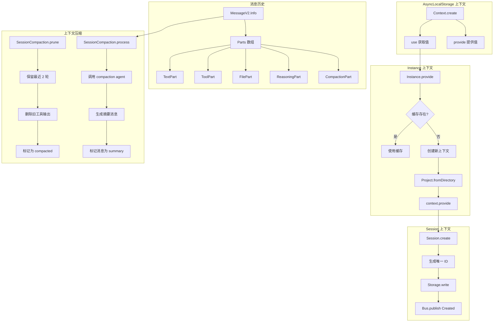
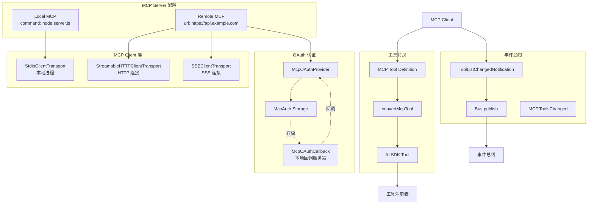

# OpenCode Agent 运行流程与架构分析

## 目录

- [Agent 运行流程](#agent-运行流程)
- [上下文管理](#上下文管理)
- [MCP 架构](#mcp-架构)

---

## Agent 运行流程

### 1. 整体流程图



### 2. 核心组件详解

#### 2.1 SessionPrompt (会话提示处理)

**文件**: `packages/opencode/src/session/prompt.ts`

**主要职责**:

- 处理用户输入并创建消息
- 管理会话主循环
- 解析和准备工具
- 处理文件、Agent 引用等特殊输入

**关键方法**:

```typescript
// 处理用户提示
export const prompt = fn(PromptInput, async (input) => {
  const message = await createUserMessage(input)
  if (input.noReply === true) return message
  return loop(input.sessionID)
})

// 主循环
export const loop = fn(Identifier.schema("session"), async (sessionID) => {
  while (true) {
    // 1. 获取消息历史
    let msgs = await MessageV2.filterCompacted(MessageV2.stream(sessionID))

    // 2. 处理待处理的 subtask 或 compaction
    if (task?.type === "subtask") {
      // 执行子任务工具
      continue
    }

    // 3. 检查是否需要上下文压缩
    if (await SessionCompaction.isOverflow(...)) {
      await SessionCompaction.create({ auto: true })
      continue
    }

    // 4. 正常处理流程
    const processor = SessionProcessor.create({...})
    const tools = await resolveTools({...})
    const result = await processor.process({
      messages: MessageV2.toModelMessages(sessionMessages, model),
      tools,
      model,
    })

    // 5. 处理结果
    if (result === "stop") break
    if (result === "compact") {
      await SessionCompaction.create({ auto: true })
    }
  }
})
```

#### 2.2 SessionProcessor (会话处理器)

**文件**: `packages/opencode/src/session/processor.ts`

**主要职责**:

- 处理 LLM 流式输出
- 管理工具调用生命周期
- 处理各种流事件类型

**流事件处理**:

```typescript
async function process(streamInput: LLM.StreamInput) {
  const stream = await LLM.stream(streamInput)

  for await (const value of stream.fullStream) {
    switch (value.type) {
      case "start":
        SessionStatus.set(input.sessionID, { type: "busy" })
        break

      case "reasoning-start":
        // 创建推理部分
        reasoningMap[value.id] = {
          id: Identifier.ascending("part"),
          type: "reasoning",
          text: "",
          time: { start: Date.now() },
        }
        break

      case "reasoning-delta":
        // 更新推理内容
        reasoningMap[value.id].text += value.text
        await Session.updatePart({ part, delta: value.text })
        break

      case "tool-input-start":
        // 开始工具输入
        const part = await Session.updatePart({
          type: "tool",
          tool: value.toolName,
          state: { status: "pending", input: {}, raw: "" },
        })
        break

      case "tool-call":
        // 执行工具调用
        const tool = toolcalls[value.toolCallId]
        await Session.updatePart({
          ...tool,
          state: { status: "running", input: value.input },
        })
        break

      case "tool-result":
        // 处理工具结果
        await Session.updatePart({
          ...match,
          state: {
            status: "completed",
            input: value.input,
            output: value.output.output,
          },
        })
        break

      case "tool-error":
        // 处理工具错误
        await Session.updatePart({
          ...match,
          state: { status: "error", error: value.error },
        })
        break

      case "finish-step":
        // 步骤完成，计算成本和 Token
        const usage = Session.getUsage({...})
        await Session.updatePart({ type: "step-finish", tokens: usage.tokens })
        break
    }
  }
}
```

#### 2.3 LLM (语言模型接口)

**文件**: `packages/opencode/src/session/llm.ts`

**主要职责**:

- 与 AI SDK 集成
- 处理不同 Provider 的转换
- 管理工具权限和过滤

**关键方法**:

```typescript
export async function stream(input: StreamInput) {
  const [language, cfg, provider, auth] = await Promise.all([
    Provider.getLanguage(input.model),
    Config.get(),
    Provider.getProvider(input.model.providerID),
    Auth.get(input.model.providerID),
  ])

  // 构建系统提示
  const system = [
    input.agent.prompt ? [input.agent.prompt] : SystemPrompt.provider(input.model),
    ...input.system,
    input.user.system ? [input.user.system] : [],
  ].join("\n")

  // 解析工具
  const tools = await resolveTools(input)

  return streamText({
    model: wrapLanguageModel({ model: language, middleware: [...] }),
    messages: [...system.map(...), ...input.messages],
    tools,
    maxOutputTokens,
    providerOptions: ProviderTransform.providerOptions(input.model, params.options),
  })
}
```

#### 2.4 ToolRegistry (工具注册表)

**文件**: `packages/opencode/src/tool/registry.ts`

**主要职责**:

- 管理所有可用工具
- 支持自定义工具和插件工具
- 根据模型和 Agent 过滤工具

**工具加载流程**:

```typescript
const state = Instance.state(async () => {
  const custom = [] as Tool.Info[]

  // 1. 扫描自定义工具目录
  for (const dir of await Config.directories()) {
    for await (const match of glob.scan({ cwd: dir })) {
      const mod = await import(match)
      for (const [id, def] of Object.entries(mod)) {
        custom.push(fromPlugin(id, def))
      }
    }
  }

  // 2. 加载插件工具
  const plugins = await Plugin.list()
  for (const plugin of plugins) {
    for (const [id, def] of Object.entries(plugin.tool ?? {})) {
      custom.push(fromPlugin(id, def))
    }
  }

  return { custom }
})

// 获取可用工具
export async function tools(model: {...}, agent?: Agent.Info) {
  const allTools = await all()
  return allTools
    .filter(t => {
      // 过滤逻辑
      if (t.id === "codesearch") {
        return model.providerID === "opencode" || Flag.OPENCODE_ENABLE_EXA
      }
      return true
    })
    .map(t => ({
      id: t.id,
      ...(await t.init({ agent })),
    }))
}
```

---

## 上下文管理

### 1. 上下文架构图



### 2. 核心上下文机制

#### 2.1 AsyncLocalStorage 上下文

**文件**: `packages/opencode/src/util/context.ts`

```typescript
import { AsyncLocalStorage } from "async_hooks"

export namespace Context {
  export function create<T>(name: string) {
    const storage = new AsyncLocalStorage<T>()
    return {
      use() {
        const result = storage.getStore()
        if (!result) {
          throw new NotFound(name)
        }
        return result
      },
      provide<R>(value: T, fn: () => R) {
        return storage.run(value, fn)
      },
    }
  }
}
```

**使用示例**:

```typescript
// 在 Instance.ts 中
const context = Context.create<{ directory: string; project: Project.Info }>("instance")

// 提供上下文
context.provide({ directory: "/path", project: {...} }, async () => {
  // 在这里可以通过 context.use() 访问
  const { directory, project } = context.use()
})

// 在其他文件中使用
export const Instance = {
  get directory() {
    return context.use().directory
  }
}
```

#### 2.2 Instance 上下文

**文件**: `packages/opencode/src/project/instance.ts`

```typescript
const cache = new Map<string, Promise<Context>>()

export const Instance = {
  async provide<R>(input: { directory: string; fn: () => R }): Promise<R> {
    let existing = cache.get(input.directory)
    if (!existing) {
      existing = iife(async () => {
        const { project, sandbox } = await Project.fromDirectory(input.directory)
        const ctx = { directory: input.directory, worktree: sandbox, project }
        await context.provide(ctx, async () => {
          await input.init?.()
        })
        return ctx
      })
      cache.set(input.directory, existing)
    }
    const ctx = await existing
    return context.provide(ctx, async () => {
      return input.fn()
    })
  },
}
```

#### 2.3 Session 上下文

**文件**: `packages/opencode/src/session/index.ts`

Session 通过 ID 关联所有消息和部分:

```typescript
export namespace Session {
  export const Info = z.object({
    id: Identifier.schema("session"),
    slug: z.string(),
    projectID: z.string(),
    directory: z.string(),
    parentID: Identifier.schema("session").optional(),
    title: z.string(),
    time: z.object({
      created: z.number(),
      updated: z.number(),
      compacting: z.number().optional(),
    }),
    permission: PermissionNext.Ruleset.optional(),
  })

  // 获取消息列表
  export const messages = fn(
    z.object({
      sessionID: Identifier.schema("session"),
    }),
    async (input) => {
      const result = [] as MessageV2.WithParts[]
      for await (const msg of MessageV2.stream(input.sessionID)) {
        result.push(msg)
      }
      result.reverse()
      return result
    },
  )
}
```

#### 2.4 MessageV2 消息结构

**文件**: `packages/opencode/src/session/message-v2.ts`

```typescript
export namespace MessageV2 {
  export const TextPart = z.object({
    id: z.string(),
    sessionID: z.string(),
    messageID: z.string(),
    type: z.literal("text"),
    text: z.string(),
    synthetic: z.boolean().optional(),
    time: z
      .object({
        start: z.number(),
        end: z.number().optional(),
      })
      .optional(),
  })

  export const ToolPart = z.object({
    id: z.string(),
    sessionID: z.string(),
    messageID: z.string(),
    type: z.literal("tool"),
    tool: z.string(),
    callID: z.string(),
    state: z.object({
      status: z.enum(["pending", "running", "completed", "error"]),
      input: z.record(z.string(), z.any()),
      output: z.string().optional(),
      error: z.string().optional(),
      time: z.object({
        start: z.number(),
        end: z.number().optional(),
        compacted: z.number().optional(),
      }),
    }),
  })

  export const ReasoningPart = z.object({
    id: z.string(),
    sessionID: z.string(),
    messageID: z.string(),
    type: z.literal("reasoning"),
    text: z.string(),
    metadata: z.record(z.string(), z.any()).optional(),
    time: z.object({
      start: z.number(),
      end: z.number().optional(),
    }),
  })
}
```

### 3. 上下文压缩机制

#### 3.1 压缩触发条件

**文件**: `packages/opencode/src/session/compaction.ts`

```typescript
export async function isOverflow(input: { tokens: MessageV2.Assistant["tokens"]; model: Provider.Model }) {
  const config = await Config.get()
  if (config.compaction?.auto === false) return false

  const context = input.model.limit.context
  const count = input.tokens.input + input.tokens.cache.read + input.tokens.output
  const output = Math.min(input.model.limit.output, SessionPrompt.OUTPUT_TOKEN_MAX)
  const usable = input.model.limit.input || context - output

  // 当使用的 Token 超过可用限制时触发压缩
  return count > usable
}
```

#### 3.2 Pruning 机制

```typescript
export async function prune(input: { sessionID: string }) {
  const msgs = await Session.messages({ sessionID: input.sessionID })

  // 从后往前遍历，保留最近 2 轮对话
  loop: for (let msgIndex = msgs.length - 1; msgIndex >= 0; msgIndex--) {
    const msg = msgs[msgIndex]
    if (msg.info.role === "user") turns++
    if (turns < 2) continue

    // 跳过已压缩的消息
    if (msg.info.role === "assistant" && msg.info.summary) break loop

    for (const part of msg.parts) {
      if (part.type === "tool" && part.state.status === "completed") {
        // 保留保护工具
        if (PRUNE_PROTECTED_TOOLS.includes(part.tool)) continue

        // 标记为已压缩
        part.state.time.compacted = Date.now()
        await Session.updatePart(part)
      }
    }
  }
}
```

#### 3.3 Compaction 过程

```typescript
export async function process(input: {
  parentID: string
  messages: MessageV2.WithParts[]
  sessionID: string
  abort: AbortSignal
  auto: boolean
}) {
  // 1. 创建 compaction agent 消息
  const agent = await Agent.get("compaction")
  const msg = await Session.updateMessage({
    id: Identifier.ascending("message"),
    role: "assistant",
    agent: "compaction",
    summary: true, // 标记为摘要
    ...
  })

  // 2. 生成摘要提示
  const promptText =
    "Provide a detailed prompt for continuing our conversation above. " +
    "Focus on information that would be helpful for continuing..."

  // 3. 调用 LLM 生成摘要
  const processor = SessionProcessor.create({...})
  const result = await processor.process({
    messages: [
      ...MessageV2.toModelMessages(input.messages, model),
      { role: "user", content: promptText },
    ],
    tools: {}, // 不使用工具
    model,
  })

  // 4. 创建后续用户消息
  if (result === "continue" && input.auto) {
    const continueMsg = await Session.updateMessage({
      id: Identifier.ascending("message"),
      role: "user",
      sessionID: input.sessionID,
      ...
    })
    await Session.updatePart({
      type: "text",
      synthetic: true,
      text: "Continue if you have next steps",
    })
  }

  return "continue"
}
```

---

## MCP 架构

### 1. MCP 整体架构



### 2. MCP 状态管理

**文件**: `packages/opencode/src/mcp/index.ts`

```typescript
const state = Instance.state(
  async () => {
    const cfg = await Config.get()
    const config = cfg.mcp ?? {}
    const clients: Record<string, MCPClient> = {}
    const status: Record<string, Status> = {}

    // 初始化所有配置的 MCP 服务器
    await Promise.all(
      Object.entries(config).map(async ([key, mcp]) => {
        if (mcp.enabled === false) {
          status[key] = { status: "disabled" }
          return
        }

        const result = await create(key, mcp).catch(() => undefined)
        if (!result) return

        status[key] = result.status
        if (result.mcpClient) {
          clients[key] = result.mcpClient
        }
      }),
    )

    return { status, clients }
  },
  async (state) => {
    // 清理资源
    await Promise.all(
      Object.values(state.clients).map((client) =>
        client.close().catch((error) => {
          log.error("Failed to close MCP client", { error })
        }),
      ),
    )
    pendingOAuthTransports.clear()
  },
)
```

### 3. Local MCP 连接

```typescript
if (mcp.type === "local") {
  const [cmd, ...args] = mcp.command
  const cwd = Instance.directory

  // 创建 Stdio 传输
  const transport = new StdioClientTransport({
    stderr: "pipe",
    command: cmd,
    args,
    cwd,
    env: {
      ...process.env,
      ...(cmd === "opencode" ? { BUN_BE_BUN: "1" } : {}),
      ...mcp.environment,
    },
  })

  // 监听 stderr 输出
  transport.stderr?.on("data", (chunk: Buffer) => {
    log.info(`mcp stderr: ${chunk.toString()}`, { key })
  })

  try {
    const client = new Client({
      name: "opencode",
      version: Installation.VERSION,
    })
    await withTimeout(client.connect(transport), connectTimeout)
    registerNotificationHandlers(client, key)

    mcpClient = client
    status = { status: "connected" }
  } catch (error) {
    status = {
      status: "failed",
      error: error instanceof Error ? error.message : String(error),
    }
  }
}
```

### 4. Remote MCP 连接与 OAuth

#### 4.1 OAuth 认证流程

```typescript
async function create(key: string, mcp: Config.Mcp) {
  if (mcp.type === "remote") {
    // OAuth 默认启用，除非显式禁用
    const oauthDisabled = mcp.oauth === false
    const oauthConfig = typeof mcp.oauth === "object" ? mcp.oauth : undefined

    let authProvider: McpOAuthProvider | undefined

    if (!oauthDisabled) {
      authProvider = new McpOAuthProvider(
        key,
        mcp.url,
        {
          clientId: oauthConfig?.clientId,
          clientSecret: oauthConfig?.clientSecret,
          scope: oauthConfig?.scope,
        },
        {
          onRedirect: async (url) => {
            log.info("oauth redirect requested", { key, url: url.toString() })
          },
        },
      )
    }

    // 尝试多种传输方式
    const transports: Array<{ name: string; transport: TransportWithAuth }> = [
      {
        name: "StreamableHTTP",
        transport: new StreamableHTTPClientTransport(new URL(mcp.url), {
          authProvider,
          requestInit: mcp.headers ? { headers: mcp.headers } : undefined,
        }),
      },
      {
        name: "SSE",
        transport: new SSEClientTransport(new URL(mcp.url), {
          authProvider,
          requestInit: mcp.headers ? { headers: mcp.headers } : undefined,
        }),
      },
    ]

    // 尝试连接
    for (const { name, transport } of transports) {
      try {
        const client = new Client({
          name: "opencode",
          version: Installation.VERSION,
        })
        await withTimeout(client.connect(transport), connectTimeout)
        registerNotificationHandlers(client, key)
        mcpClient = client
        status = { status: "connected" }
        break
      } catch (error) {
        // 处理 OAuth 错误
        if (error instanceof UnauthorizedError) {
          // 需要认证
          pendingOAuthTransports.set(key, transport)
          status = { status: "needs_auth" }
          break
        }

        // 继续尝试下一个传输方式
        status = {
          status: "failed",
          error: lastError.message,
        }
      }
    }
  }
}
```

#### 4.2 OAuth 认证流程

```typescript
export async function authenticate(mcpName: string): Promise<Status> {
  const { authorizationUrl } = await startAuth(mcpName)

  if (!authorizationUrl) {
    // 已认证
    const s = await state()
    return s.status[mcpName] ?? { status: "connected" }
  }

  // 获取已生成的 OAuth state
  const oauthState = await McpAuth.getOAuthState(mcpName)

  // 注册回调
  const callbackPromise = McpOAuthCallback.waitForCallback(oauthState)

  try {
    // 打开浏览器
    await open(authorizationUrl)
  } catch (error) {
    // 浏览器打开失败（如远程/无头环境）
    Bus.publish(BrowserOpenFailed, { mcpName, url: authorizationUrl })
  }

  // 等待回调
  const code = await callbackPromise

  // 验证 state
  const storedState = await McpAuth.getOAuthState(mcpName)
  if (storedState !== oauthState) {
    await McpAuth.clearOAuthState(mcpName)
    throw new Error("OAuth state mismatch - potential CSRF attack")
  }

  await McpAuth.clearOAuthState(mcpName)

  // 完成认证
  return finishAuth(mcpName, code)
}

export async function finishAuth(mcpName: string, authorizationCode: string): Promise<Status> {
  const transport = pendingOAuthTransports.get(mcpName)

  try {
    // 调用 transport 的 finishAuth 方法
    await transport.finishAuth(authorizationCode)

    // 清除 code verifier
    await McpAuth.clearCodeVerifier(mcpName)

    // 重新连接
    const cfg = await Config.get()
    const mcpConfig = cfg.mcp?.[mcpName]
    pendingOAuthTransports.delete(mcpName)
    const result = await add(mcpName, mcpConfig)

    return result.status[mcpName]
  } catch (error) {
    return {
      status: "failed",
      error: error instanceof Error ? error.message : String(error),
    }
  }
}
```

### 5. MCP 工具转换

```typescript
// 将 MCP 工具转换为 AI SDK Tool
async function convertMcpTool(mcpTool: MCPToolDef, client: MCPClient, timeout?: number): Promise<Tool> {
  const inputSchema = mcpTool.inputSchema

  const schema: JSONSchema7 = {
    ...(inputSchema as JSONSchema7),
    type: "object",
    properties: (inputSchema.properties ?? {}) as JSONSchema7["properties"],
    additionalProperties: false,
  }

  return dynamicTool({
    description: mcpTool.description ?? "",
    inputSchema: jsonSchema(schema),
    execute: async (args: unknown) => {
      return client.callTool(
        {
          name: mcpTool.name,
          arguments: (args || {}) as Record<string, unknown>,
        },
        CallToolResultSchema,
        {
          resetTimeoutOnProgress: true,
          timeout,
        },
      )
    },
  })
}

// 获取所有 MCP 工具
export async function tools() {
  const result: Record<string, Tool> = {}
  const s = await state()
  const clientsSnapshot = await clients()
  const defaultTimeout = (await Config.get()).experimental?.mcp_timeout

  for (const [clientName, client] of Object.entries(clientsSnapshot)) {
    // 只包含已连接的 MCP
    if (s.status[clientName]?.status !== "connected") {
      continue
    }

    const toolsResult = await client.listTools().catch((e) => {
      log.error("failed to get tools", { clientName, error: e.message })
      // 标记为失败状态
      s.status[clientName] = {
        status: "failed",
        error: e instanceof Error ? e.message : String(e),
      }
      delete s.clients[clientName]
      return undefined
    })

    if (!toolsResult) continue

    for (const mcpTool of toolsResult.tools) {
      const sanitizedClientName = clientName.replace(/[^a-zA-Z0-9_-]/g, "_")
      const sanitizedToolName = mcpTool.name.replace(/[^a-zA-Z0-9_-]/g, "_")
      result[sanitizedClientName + "_" + sanitizedToolName] = await convertMcpTool(mcpTool, client, timeout)
    }
  }

  return result
}
```

### 6. MCP 事件通知

```typescript
// 注册通知处理器
function registerNotificationHandlers(client: MCPClient, serverName: string) {
  client.setNotificationHandler(
    ToolListChangedNotificationSchema,
    async () => {
      log.info("tools list changed notification received", { server: serverName })
      // 发布事件，通知工具列表已变更
      Bus.publish(ToolsChanged, { server: serverName })
    }
  )
}

// 在 session/prompt.ts 中使用
export const ToolsChanged = BusEvent.define(
  "mcp.tools.changed",
  z.object({
    server: z.string(),
  }),
)

// 工具执行时包装 MCP 工具
for (const [key, item] of Object.entries(await MCP.tools())) {
  const execute = item.execute
  if (!execute) continue

  // 包装 execute 添加插件钩子和格式化输出
  item.execute = async (args, opts) => {
    const ctx = context(args, opts)

    await Plugin.trigger(
      "tool.execute.before",
      { tool: key, sessionID: ctx.sessionID, callID: opts.toolCallId },
      { args },
    )

    // 请求权限
    await ctx.ask({
      permission: key,
      patterns: ["*"],
      always: ["*"],
    })

    // 执行 MCP 工具
    const result = await execute(args, opts)

    // 格式化输出
    const textParts: string[] = []
    const attachments: Omit<MessageV2.FilePart, "id" | "messageID" | "sessionID">[] = []

    for (const contentItem of result.content) {
      if (contentItem.type === "text") {
        textParts.push(contentItem.text)
      } else if (contentItem.type === "image") {
        attachments.push({
          type: "file",
          mime: contentItem.mimeType,
          url: `data:${contentItem.mimeType};base64,${contentItem.data}`,
        })
      } else if (contentItem.type === "resource") {
        if (contentItem.resource.text) {
          textParts.push(contentItem.resource.text)
        }
        if (contentItem.resource.blob) {
          attachments.push({
            type: "file",
            mime: contentItem.resource.mimeType ?? "application/octet-stream",
            url: `data:${...};base64,${contentItem.resource.blob}`,
            filename: contentItem.resource.uri,
          })
        }
      }
    }

    // 截断输出
    const truncated = await Truncate.output(textParts.join("\n\n"), {}, agent)

    await Plugin.trigger(
      "tool.execute.after",
      { tool: key, sessionID: ctx.sessionID, callID: opts.toolCallId },
      result,
    )

    return {
      title: "",
      metadata: { truncated: truncated.truncated },
      output: truncated.content,
      attachments,
    }
  }
}
```

### 7. OAuth 状态存储

**文件**: `packages/opencode/src/mcp/auth.ts`

```typescript
export namespace McpAuth {
  const filepath = path.join(Global.Path.data, "mcp-auth.json")

  export const Entry = z.object({
    tokens: Tokens.optional(),
    clientInfo: ClientInfo.optional(),
    codeVerifier: z.string().optional(),
    oauthState: z.string().optional(),
    serverUrl: z.string().optional(), // 追踪凭证对应的 URL
  })

  // 获取凭证并验证 URL
  export async function getForUrl(mcpName: string, serverUrl: string): Promise<Entry | undefined> {
    const entry = await get(mcpName)
    if (!entry) return undefined

    // 如果没有存储 serverUrl，来自旧版本 - 认为无效
    if (!entry.serverUrl) return undefined

    // 如果 URL 已更改，凭证无效
    if (entry.serverUrl !== serverUrl) return undefined

    return entry
  }

  // 保存凭证
  export async function set(mcpName: string, entry: Entry, serverUrl?: string): Promise<void> {
    const file = Bun.file(filepath)
    const data = await all()

    // 如果提供 serverUrl，始终更新
    if (serverUrl) {
      entry.serverUrl = serverUrl
    }

    await Bun.write(file, JSON.stringify({ ...data, [mcpName]: entry }, null, 2), { mode: 0o600 })
  }
}
```

---

## 总结

### Agent 运行流程关键点

1. **消息驱动循环**: `SessionPrompt.loop()` 是核心驱动引擎，持续处理用户输入和 LLM 响应
2. **流式处理**: `SessionProcessor` 处理 LLM 的流式输出，实时更新 UI
3. **工具执行**: 通过 `ToolRegistry` 解析工具，支持自定义工具、插件工具和 MCP 工具
4. **错误处理**: 自动重试机制、doom loop 检测、权限拦截

### 上下文管理关键点

1. **AsyncLocalStorage**: 用于管理实例级别的上下文（目录、项目信息）
2. **消息历史**: 通过 `MessageV2` 和 `Parts` 结构完整记录所有交互
3. **上下文压缩**: 通过 `SessionCompaction` 自动管理 Token 使用，防止溢出
4. **分层架构**: Instance → Session → Message → Part 四层结构

### MCP 架构关键点

1. **多种传输方式**: 支持 Stdio（本地）、HTTP、SSE（远程）
2. **OAuth 认证**: 完整的 OAuth 2.0 流程，支持动态客户端注册
3. **工具转换**: 将 MCP 工具转换为 AI SDK 兼容格式
4. **事件驱动**: 通过事件总线通知工具列表变更
5. **状态管理**: 持久化存储 OAuth 凭证和客户端信息，URL 变更验证

---

## 相关文件索引

### Agent 相关

- `packages/opencode/src/agent/agent.ts` - Agent 定义和配置
- `packages/opencode/src/session/prompt.ts` - 会话提示处理
- `packages/opencode/src/session/processor.ts` - 会话处理器
- `packages/opencode/src/session/llm.ts` - LLM 接口

### 上下文相关

- `packages/opencode/src/util/context.ts` - AsyncLocalStorage 封装
- `packages/opencode/src/project/instance.ts` - Instance 上下文
- `packages/opencode/src/session/index.ts` - Session 上下文
- `packages/opencode/src/session/message-v2.ts` - MessageV2 定义
- `packages/opencode/src/session/compaction.ts` - 上下文压缩

### MCP 相关

- `packages/opencode/src/mcp/index.ts` - MCP 主逻辑
- `packages/opencode/src/mcp/oauth-provider.ts` - OAuth 提供者
- `packages/opencode/src/mcp/auth.ts` - OAuth 凭证存储
- `packages/opencode/src/mcp/oauth-callback.ts` - OAuth 回调服务器

### 工具相关

- `packages/opencode/src/tool/registry.ts` - 工具注册表
- `packages/opencode/src/tool/tool.ts` - 工具接口定义

### 事件相关

- `packages/opencode/src/bus/index.ts` - 实例级事件总线
- `packages/opencode/src/bus/global.ts` - 全局事件总线
- `packages/opencode/src/bus/bus-event.ts` - 事件定义
