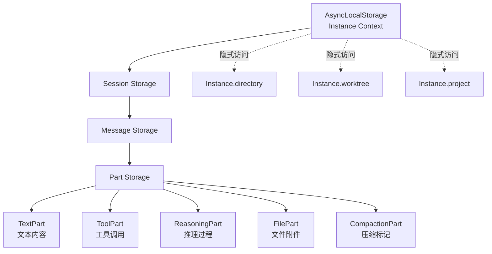
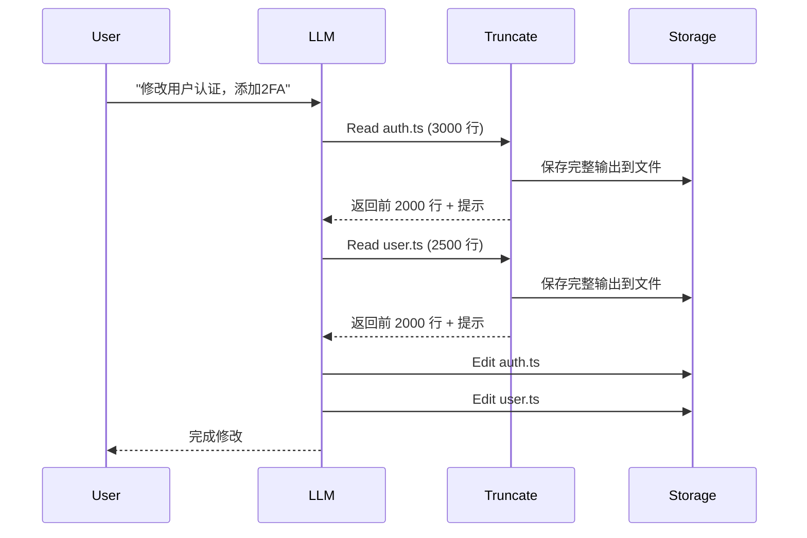
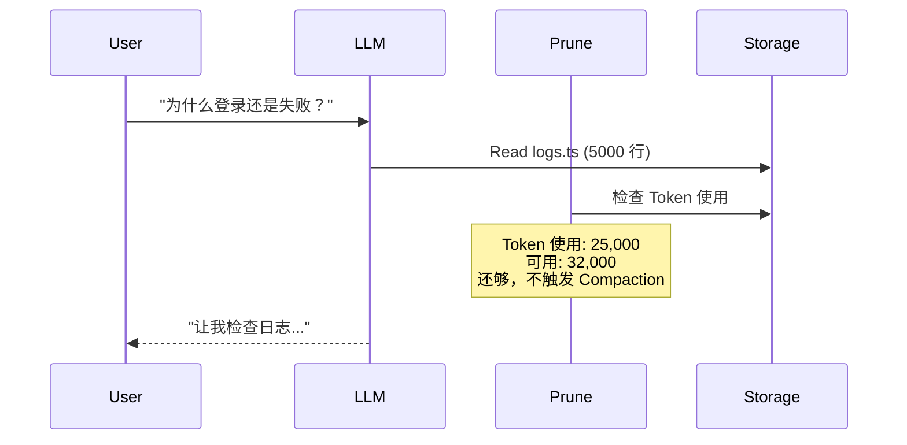
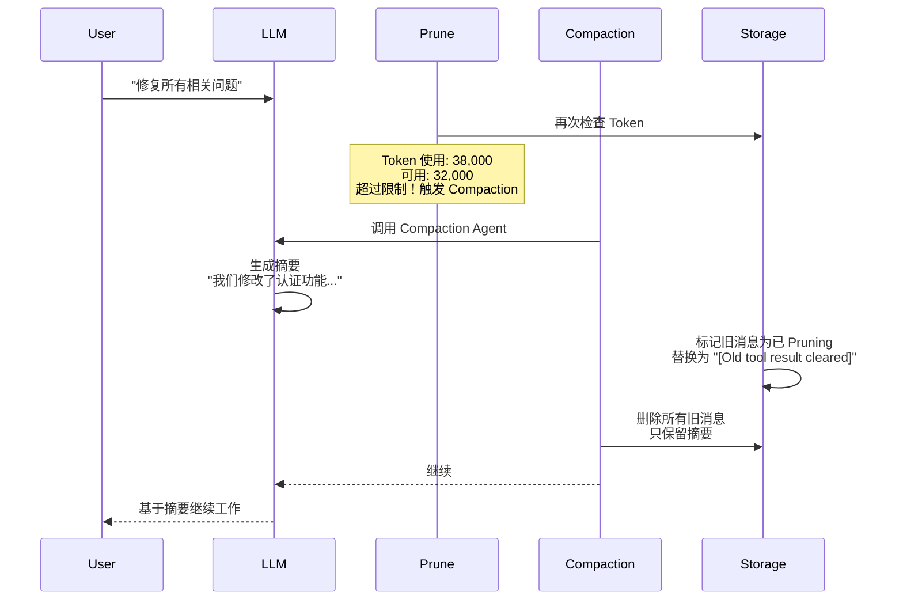
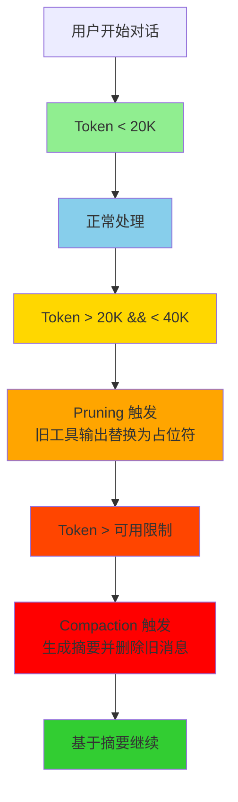

# OpenCode 上下文管理详细分析

## 目录

- [AsyncLocalStorage 上下文机制](#asynclocalstorage-上下文机制)
- [多层上下文架构](#多层上下文架构)
- [上下文压缩机制](#上下文压缩机制)
  - [Pruning: 轻量级压缩](#pruning-轻量级压缩)
  - [Compaction: 重量级压缩](#compaction-重量级压缩)
- [工具输出截断（Truncate）](#工具输出截断truncate)
- [完整流程示例](#完整流程示例)

---

## AsyncLocalStorage 上下文机制

### 1. 什么是 AsyncLocalStorage？

AsyncLocalStorage 是 Node.js 的一个 API，用于在异步调用链中传递上下文。类似于 JavaScript 的线程本地存储，但针对异步操作设计。

**文件**: `packages/opencode/src/util/context.ts`

```typescript
import { AsyncLocalStorage } from "async_hooks"

export namespace Context {
  export function create<T>(name: string) {
    const storage = new AsyncLocalStorage<T>()
    return {
      // 获取当前上下文
      use() {
        const result = storage.getStore()
        if (!result) {
          throw new NotFound(name)
        }
        return result
      },
      // 提供上下文并执行回调
      provide<R>(value: T, fn: () => R) {
        return storage.run(value, fn)
      },
    }
  }
}
```

### 2. 在 OpenCode 中的使用

#### Instance 级别上下文

**文件**: `packages/opencode/src/project/instance.ts`

```typescript
const context = Context.create<{
  directory: string
  worktree: string
  project: Project.Info
}>("instance")

const cache = new Map<string, Promise<Context>>()

export const Instance = {
  // 提供 Instance 上下文
  async provide<R>(input: { directory: string; fn: () => R }): Promise<R> {
    let existing = cache.get(input.directory)
    if (!existing) {
      existing = iife(async () => {
        const { project, sandbox } = await Project.fromDirectory(input.directory)
        const ctx = {
          directory: input.directory,
          worktree: sandbox,
          project,
        }
        // 在这个异步链中，所有代码都可以通过 context.use() 访问 ctx
        await context.provide(ctx, async () => {
          await input.init?.()
        })
        return ctx
      })
      cache.set(input.directory, existing)
    }

    const ctx = await existing
    return context.provide(ctx, async () => {
      return input.fn()
    })
  },

  // 获取当前 Instance 上下文
  get directory() {
    return context.use().directory
  },
  get worktree() {
    return context.use().worktree
  },
  get project() {
    return context.use().project
  },
}
```

#### 使用示例

```typescript
// 在任何地方，只要在 Instance.provide() 的异步链中
const dir = Instance.directory // 实际调用 context.use().directory
const project = Instance.project // 实际调用 context.use().project
```

### 3. 为什么使用 AsyncLocalStorage？

1. **隐式传递**: 不需要在每个函数间显式传递上下文
2. **类型安全**: TypeScript 类型检查确保上下文类型正确
3. **异步安全**: 自动跟踪异步调用链，不会丢失上下文
4. **避免全局变量**: 每个异步调用链有独立的上下文

---

## 多层上下文架构

OpenCode 使用四层上下文结构：



### 存储结构

```typescript
// Storage 路径结构
session/
  └── {projectID}/
      └── {sessionID}           // Session.Info
message/
  └── {sessionID}/
      └── {messageID}          // MessageV2.Info
part/
  └── {messageID}/
      ├── {partID}              // TextPart
      ├── {partID}              // ToolPart
      ├── {partID}              // ReasoningPart
      └── ...
```

### MessageV2 数据结构

```typescript
// 一个消息由多个 Part 组成
interface WithParts {
  info: Info // 消息元数据
  parts: Part[] // 消息内容
}

// Part 类型
type Part =
  | TextPart // 普通文本
  | ToolPart // 工具调用和结果
  | ReasoningPart // 模型推理过程
  | FilePart // 文件附件
  | CompactionPart // 压缩标记
  | SubtaskPart // 子任务
```

---

## 上下文压缩机制

OpenCode 使用**两层压缩策略**：

### 1. Pruning: 轻量级压缩

**目的**: 删除旧工具输出的实际内容，但保留消息结构

**文件**: `packages/opencode/src/session/compaction.ts`

```typescript
export const PRUNE_MINIMUM = 20_000 // 最少删除 20K tokens
export const PRUNE_PROTECT = 40_000 // 保留最近 40K tokens
const PRUNE_PROTECTED_TOOLS = ["skill"] // 保护某些工具不被修剪

export async function prune(input: { sessionID: string }) {
  const config = await Config.get()
  if (config.compaction?.prune === false) return

  const msgs = await Session.messages({ sessionID: input.sessionID })

  let total = 0
  let pruned = 0
  const toPrune = []
  let turns = 0

  // 从后往前遍历
  loop: for (let msgIndex = msgs.length - 1; msgIndex >= 0; msgIndex--) {
    const msg = msgs[msgIndex]

    // 统计对话轮次
    if (msg.info.role === "user") turns++

    // 保留最近 2 轮对话
    if (turns < 2) continue

    // 遇到之前的摘要消息就停止
    if (msg.info.role === "assistant" && msg.info.summary) break loop

    // 遍历每个消息的 parts
    for (let partIndex = msg.parts.length - 1; partIndex >= 0; partIndex--) {
      const part = msg.parts[partIndex]

      // 只处理已完成的工具
      if (part.type === "tool" && part.state.status === "completed") {
        // 跳过保护工具（如 skill）
        if (PRUNE_PROTECTED_TOOLS.includes(part.tool)) continue

        // 如果已经标记为 compacted，停止
        if (part.state.time.compacted) break loop

        // 估算这个工具输出的 token 数量
        const estimate = Token.estimate(part.state.output)
        total += estimate

        // 如果累计超过 40K tokens，标记为待删除
        if (total > PRUNE_PROTECT) {
          pruned += estimate
          toPrune.push(part)
        }
      }
    }
  }

  // 只有修剪量超过 20K tokens 才执行
  if (pruned > PRUNE_MINIMUM) {
    for (const part of toPrune) {
      if (part.state.status === "completed") {
        // 标记为已压缩，而不是删除
        part.state.time.compacted = Date.now()
        await Session.updatePart(part)
      }
    }
  }
}
```

**关键点**:

1. **保留最近 2 轮**: 确保最新上下文完整
2. **保护某些工具**: skill 工具不会被修剪
3. **阈值控制**: 至少删除 20K tokens 才执行
4. **标记而非删除**: 只是标记 `time.compacted`，不删除 part

### 2. 如何处理已 Pruning 的内容

**文件**: `packages/opencode/src/session/message-v2.ts`

```typescript
export function toModelMessages(input: WithParts[], model: Provider.Model): ModelMessage[] {
  const result: UIMessage[] = []

  for (const msg of input) {
    if (msg.info.role === "assistant") {
      const assistantMessage: UIMessage = {
        id: msg.info.id,
        role: "assistant",
        parts: [],
      }

      for (const part of msg.parts) {
        if (part.type === "tool") {
          toolNames.add(part.tool)

          if (part.state.status === "completed") {
            // 关键：如果已压缩，替换为占位符
            const outputText = part.state.time.compacted ? "[Old tool result content cleared]" : part.state.output

            // 已压缩的工具不返回附件
            const attachments = part.state.time.compacted ? [] : (part.state.attachments ?? [])

            const output = attachments.length > 0 ? { text: outputText, attachments } : outputText

            assistantMessage.parts.push({
              type: ("tool-" + part.tool) as `tool-${string}`,
              state: "output-available",
              toolCallId: part.callID,
              input: part.state.input,
              output, // 可能是 "[Old tool result content cleared]"
              ...(differentModel ? {} : { callProviderMetadata: part.metadata }),
            })
          }
        }
      }
    }
  }

  return convertToModelMessages(result, { tools })
}
```

**效果**: 当工具输出被 pruning 后，LLM 看到的是：

```
tool-result:
  input: { filePath: "src/app.ts" }
  output: "[Old tool result content cleared]"
```

而不是实际的 2000 行代码！

### 3. Compaction: 重量级压缩

**目的**: 当 Token 接近上限时，生成摘要并删除旧消息

**文件**: `packages/opencode/src/session/compaction.ts`

#### 触发条件

```typescript
export async function isOverflow(input: { tokens: MessageV2.Assistant["tokens"]; model: Provider.Model }) {
  const config = await Config.get()
  if (config.compaction?.auto === false) return false

  const context = input.model.limit.context
  const count = input.tokens.input + input.tokens.cache.read + input.tokens.output

  // 计算可用 Token（预留输出空间）
  const output = Math.min(input.model.limit.output, SessionPrompt.OUTPUT_TOKEN_MAX) || SessionPrompt.OUTPUT_TOKEN_MAX

  const usable = input.model.limit.input || context - output

  // 超过可用限制时触发压缩
  return count > usable
}
```

#### 压缩执行流程

```typescript
export async function process(input: {
  parentID: string
  messages: MessageV2.WithParts[]
  sessionID: string
  abort: AbortSignal
  auto: boolean
}) {
  const userMessage = input.messages.findLast((m) => m.info.id === input.parentID)!.info as MessageV2.User

  // 1. 获取 compaction agent
  const agent = await Agent.get("compaction")

  // 2. 选择模型：优先使用 agent.model，否则使用 userMessage.model
  // 这意味着压缩可能使用与主模型相同的模型！
  const model = agent.model
    ? await Provider.getModel(agent.model.providerID, agent.model.modelID)
    : await Provider.getModel(userMessage.model.providerID, userMessage.model.modelID)

  // 3. 创建 compaction 消息（标记为 summary）
  const msg = (await Session.updateMessage({
    id: Identifier.ascending("message"),
    role: "assistant",
    parentID: input.parentID,
    sessionID: input.sessionID,
    mode: "compaction",
    agent: "compaction",
    summary: true, // 标记为摘要消息
    path: { cwd: Instance.directory, root: Instance.worktree },
    cost: 0,
    tokens: { output: 0, input: 0, reasoning: 0, cache: { read: 0, write: 0 } },
    modelID: model.id,
    providerID: model.providerID,
    time: { created: Date.now() },
  })) as MessageV2.Assistant

  const processor = SessionProcessor.create({
    assistantMessage: msg,
    sessionID: input.sessionID,
    model,
    abort: input.abort,
  })

  // 4. 允许插件注入上下文或替换提示词
  const compacting = await Plugin.trigger(
    "experimental.session.compacting",
    { sessionID: input.sessionID },
    { context: [], prompt: undefined },
  )

  // 5. 构建摘要提示词
  const defaultPrompt =
    "Provide a detailed prompt for continuing our conversation above. " +
    "Focus on information that would be helpful for continuing the conversation, " +
    "including what we did, what we're doing, which files we're working on, " +
    "and what we're going to do next considering new session will not have access to our conversation."

  const promptText = compacting.prompt ?? [defaultPrompt, ...compacting.context].join("\n\n")

  // 6. 调用 LLM 生成摘要（不使用工具）
  const result = await processor.process({
    user: userMessage,
    agent,
    abort: input.abort,
    sessionID: input.sessionID,
    tools: {}, // 不使用工具！
    system: [],
    messages: [
      ...MessageV2.toModelMessages(input.messages, model),
      {
        role: "user",
        content: [{ type: "text", text: promptText }],
      },
    ],
    model,
  })

  // 7. 自动模式下，创建后续用户消息
  if (result === "continue" && input.auto) {
    const continueMsg = await Session.updateMessage({
      id: Identifier.ascending("message"),
      role: "user",
      sessionID: input.sessionID,
      time: { created: Date.now() },
      agent: userMessage.agent,
      model: userMessage.model,
    })

    await Session.updatePart({
      id: Identifier.ascending("part"),
      messageID: continueMsg.id,
      sessionID: input.sessionID,
      type: "text",
      synthetic: true,
      text: "Continue if you have next steps",
    })
  }

  if (processor.message.error) return "stop"

  Bus.publish(Event.Compacted, { sessionID: input.sessionID })
  return "continue"
}
```

#### 摘要后的消息过滤

**文件**: `packages/opencode/src/session/message-v2.ts`

```typescript
export async function filterCompacted(stream: AsyncIterable<MessageV2.WithParts>) {
  const result = [] as MessageV2.WithParts[]
  const completed = new Set<string>()

  for await (const msg of stream) {
    result.push(msg)

    // 如果遇到已完成的摘要消息后的用户消息，停止加载
    if (
      msg.info.role === "user" &&
      completed.has(msg.info.id) &&
      msg.parts.some((part) => part.type === "compaction")
    ) {
      break
    }

    // 标记摘要消息的父消息为已完成
    if (msg.info.role === "assistant" && msg.info.summary && msg.info.finish) {
      completed.add(msg.info.parentID)
    }
  }

  result.reverse()
  return result
}
```

**效果**: compaction 后，只保留：

1. Compaction 消息（摘要）
2. 之后的用户消息和助手回复

所有之前的多轮对话都被删除了！

---

## 工具输出截断（Truncate）

这是应对单次工具输出过长的第一道防线。

### 触发阈值

**文件**: `packages/opencode/src/tool/truncation.ts`

```typescript
export const MAX_LINES = 2000 // 最多 2000 行
export const MAX_BYTES = 50 * 1024 // 最多 50KB

export async function output(text: string, options: Options = {}, agent?: Agent.Info): Promise<Result> {
  const maxLines = options.maxLines ?? MAX_LINES
  const maxBytes = options.maxBytes ?? MAX_BYTES
  const direction = options.direction ?? "head"

  const lines = text.split("\n")
  const totalBytes = Buffer.byteLength(text, "utf-8")

  // 如果未超过阈值，直接返回
  if (lines.length <= maxLines && totalBytes <= maxBytes) {
    return { content: text, truncated: false }
  }

  // 截断逻辑
  const out: string[] = []
  let i = 0
  let bytes = 0
  let hitBytes = false

  if (direction === "head") {
    // 从开头截断（默认）
    for (i = 0; i < lines.length && i < maxLines; i++) {
      const size = Buffer.byteLength(lines[i], "utf-8") + (i > 0 ? 1 : 0)
      if (bytes + size > maxBytes) {
        hitBytes = true
        break
      }
      out.push(lines[i])
      bytes += size
    }
  } else {
    // 从末尾截断
    for (i = lines.length - 1; i >= 0 && out.length < maxLines; i--) {
      const size = Buffer.byteLength(lines[i], "utf-8") + (out.length > 0 ? 1 : 0)
      if (bytes + size > maxBytes) {
        hitBytes = true
        break
      }
      out.unshift(lines[i])
      bytes += size
    }
  }

  const removed = hitBytes ? totalBytes - bytes : lines.length - out.length
  const unit = hitBytes ? "bytes" : "lines"
  const preview = out.join("\n")

  // 保存完整输出到文件
  const id = Identifier.ascending("tool")
  const filepath = path.join(DIR, id)
  await Bun.write(Bun.file(filepath), text)

  // 生成提示
  const hasTaskTool = checkHasTaskTool(agent)
  const hint = hasTaskTool
    ? `The tool call succeeded but the output was truncated. ` +
      `Full output saved to: ${filepath}\n` +
      `Use the Task tool to have the explore agent process this file with Grep and Read. ` +
      `Do NOT read the full file yourself - delegate to save context.`
    : `The tool call succeeded but the output was truncated. ` +
      `Full output saved to: ${filepath}\n` +
      `Use Grep to search the full content or Read with offset/limit to view specific sections.`

  const message =
    direction === "head"
      ? `${preview}\n\n...${removed} ${unit} truncated...\n\n${hint}`
      : `...${removed} ${unit} truncated...\n\n${hint}\n\n${preview}`

  return { content: message, truncated: true, outputPath: filepath }
}
```

### 应用到工具执行

**文件**: `packages/opencode/src/tool/tool.ts`

```typescript
export function define<Parameters extends z.ZodType, Result extends Metadata>(
  id: string,
  init: Tool.Info<Parameters, Result>["init"],
): Tool.Info<Parameters, Result> {
  return {
    id,
    init: async (initCtx) => {
      const toolInfo = init instanceof Function ? await init(initCtx) : init
      const execute = toolInfo.execute

      // 包装 execute 函数
      toolInfo.execute = async (args, ctx) => {
        // 验证参数
        toolInfo.parameters.parse(args)

        const result = await execute(args, ctx)

        // 跳过工具自行处理截断的情况
        if (result.metadata.truncated !== undefined) {
          return result
        }

        // 自动截断输出！
        const truncated = await Truncate.output(result.output, {}, initCtx?.agent)

        return {
          ...result,
          output: truncated.content, // 替换为截断后的内容
          metadata: {
            ...result.metadata,
            truncated: truncated.truncated,
            ...(truncated.truncated && { outputPath: truncated.outputPath }),
          },
        }
      }
      return toolInfo
    },
  }
}
```

### 效果示例

#### 原始输出（2000 行代码）

```
tool-result:
  output: |
    import React from 'react'
    // ... 2000 行代码
    export default function App() { ... }
```

#### 截断后

```
tool-result:
  output: |
    import React from 'react'
    import { useState } from 'react'
    // ... 最多 2000 行或 50KB ...
    export function useCounter() {
      const [count, setCount] = useState(0)
      return { count, setCount }
    }

    ...15000 bytes truncated...

    The tool call succeeded but the output was truncated.
    Full output saved to: /Users/xxx/.opencode/tool-output/tool_abc123
    Use Grep to search the full content or Read with offset/limit to view specific sections.
```

---

## 完整流程示例

### 场景：修改一个功能，涉及多次工具调用

假设用户要求：**"修改用户认证功能，添加双因素认证"**

#### 第 1 轮对话



**Token 消耗**:

```
- 用户消息: ~100 tokens
- Read auth.ts (截断后): ~8,000 tokens
- Read user.ts (截断后): ~8,000 tokens
- Edit 调用: ~500 tokens
- LLM 输出: ~1,500 tokens
总计: ~18,100 tokens
```

**关键点**:

1. 每个 Read 工具输出都自动截断到 2000 行或 50KB
2. 完整输出保存到 `~/.opencode/tool-output/tool_xxx`
3. LLM 看到的是截断后的内容 + 提示信息

#### 第 2 轮对话（用户追问）



#### 第 3 轮对话（继续深入）



**Compaction 上下文**:

```typescript
// 之前的消息（已删除）
[
  { role: "user", text: "修改用户认证..." },
  { role: "assistant", tool_calls: [
      { tool: "read", output: "[Old tool result content cleared]" },
      { tool: "read", output: "[Old tool result content cleared]" },
      { tool: "edit", output: "..." }
    ]
  },
  { role: "user", text: "为什么登录失败？" },
  { role: "assistant", tool_calls: [
      { tool: "read", output: "[Old tool result content cleared]" }
    ]
  }
]

// 新增的 Compaction 消息
{ role: "assistant", summary: true, text: |
  We modified the user authentication system to add 2FA:
  - Updated auth.ts to add TOTP verification
  - Modified user.ts to store 2FA secret
  - Changed login flow to require 2FA code

  Next steps:
  - Test the 2FA implementation
  - Update user documentation
|
}

// 之后的新消息
{ role: "user", text: "修复所有相关问题" }
```

**Token 消耗（Compaction 后）**:

```
- Compaction 消息: ~800 tokens
- 用户新消息: ~200 tokens
总计: ~1,000 tokens (之前是 38,000+！)
```

---

## 关键问题解答

### 1. 压缩使用的模型和主模型一样吗？

**答案: 是的，但可以配置**

```typescript
const model = agent.model
  ? await Provider.getModel(agent.model.providerID, agent.model.modelID)
  : await Provider.getModel(userMessage.model.providerID, userMessage.model.modelID)
```

**优先级**:

1. 如果 compaction agent 配置了 `model`，使用配置的模型
2. 否则，使用当前会话的模型（即主模型）

**Compaction Agent 配置**:

```typescript
compaction: {
  name: "compaction",
  mode: "primary",
  hidden: true,
  prompt: PROMPT_COMPACTION,
  // model: {  // 可以显式指定
  //   providerID: "anthropic",
  //   modelID: "claude-3-haiku-20240307"
  // }
  permission: PermissionNext.merge(defaults, user),
  options: {},
}
```

### 2. 多次工具调用导致上下文过长怎么办？

**OpenCode 的三层防御**:

#### 第一层: Truncate（单次工具）

- 每个 Read/Grep 工具输出自动截断到 2000 行或 50KB
- 完整内容保存到文件
- LLM 得到提示："Use Read with offset/limit to view specific sections"

#### 第二层: Pruning（历史消息）

- 保留最近 2 轮对话完整内容
- 超过 40K tokens 的旧工具输出替换为 "[Old tool result content cleared]"
- 不是删除，是替换占位符

#### 第三层: Compaction（严重溢出）

- 当 Token 超过可用限制时触发
- 生成详细摘要，包含：
  - 做了什么
  - 正在做什么
  - 操作了哪些文件
  - 接下来要做什么
- 删除摘要之前的所有消息

### 3. AsyncLocalStorage 的优势？

#### 传统方式（显式传递）

```typescript
// 到处传递 context
function readFile(context: { directory: string }) {
  const filePath = path.join(context.directory, "file.txt")
  return Bun.file(filePath).text()
}

function processFile(context: { directory: string }) {
  const content = readFile(context) // 需要传递
  return process(content)
}

// 使用
const context = { directory: "/path" }
processFile(context)
```

#### AsyncLocalStorage 方式（隐式传递）

```typescript
// 只在入口点提供一次
Instance.provide({ directory: "/path" }, async () => {
  // 所有后续函数都可以直接使用
  const filePath = path.join(Instance.directory, "file.txt")
  return processFile()
})

function processFile() {
  const filePath = path.join(Instance.directory, "file.txt")
  // 不需要传递 context！
}
```

### 4. 实际使用场景建议

#### 场景 1: 大文件读取

```typescript
// 不要这样做：一次性读取整个文件
read({ filePath: "large-file.json" }) // 返回 10,000 行

// 应该这样做：使用 offset/limit
read({ filePath: "large-file.json", offset: 0, limit: 100 }) // 先读前 100 行
// 然后根据需要继续读取
```

#### 场景 2: 多文件搜索

```typescript
// 不要这样做：多次 Read
for (const file of files) {
  read({ filePath: file }) // 每个都可能很长
}

// 应该这样做：使用 Grep 先定位
grep({ pattern: "function authenticate", paths: files }) // 返回匹配的行
// 然后只 Read 相关文件
```

#### 场景 3: 批量修改

```typescript
// 考虑使用 batch 工具（如果启用）
batch({
  operations: [
    { type: "edit", file: "file1.ts", ... },
    { type: "edit", file: "file2.ts", ... },
    { type: "edit", file: "file3.ts", ... },
  ]
})
```

---

## 配置选项

```typescript
// config.json
{
  "compaction": {
    "auto": true,        // 自动压缩（默认 true）
    "prune": true       // 启用 Pruning（默认 true）
  },
  "experimental": {
    "mcp_timeout": 30000,  // MCP 超时时间
    "output_token_max": 32000  // 最大输出 Token
  }
}
```

---

## 相关文件

- `packages/opencode/src/util/context.ts` - AsyncLocalStorage 封装
- `packages/opencode/src/project/instance.ts` - Instance 上下文
- `packages/opencode/src/session/compaction.ts` - 压缩逻辑
- `packages/opencode/src/session/message-v2.ts` - 消息和 Part 结构
- `packages/opencode/src/tool/truncation.ts` - 工具输出截断
- `packages/opencode/src/util/token.ts` - Token 估算

---

## 完整对话示例：创建简单前端项目

### 场景描述
用户要求创建一个使用 React + TypeScript + Tailwind CSS 的简单前端项目，包含登录页面和用户列表。

### 环境设置
```
模型: claude-3-5-sonnet-20241022
上下文限制: 200,000 tokens
最大输出: 32,000 tokens
项目目录: /Users/dev/my-frontend
```

---

## 对话轮次 1：初始化项目

### 用户消息
```
帮我创建一个 React + TypeScript + Tailwind CSS 的前端项目，包含登录页面和用户列表页面
```

**Token 消耗**: ~80 tokens

### LLM 响应（工具调用）

```
我来帮你创建这个项目。首先让我查看当前目录结构。
```

### 工具调用 1.1：List 目录

```typescript
调用: ls({ path: "." })
实际输出:
[
  ".git",
  "node_modules",  // 2500 行
  "src",
  "package.json",
  "README.md",
  "tsconfig.json",
  "vite.config.ts",
  ...
]
```

**未触发 Truncate**: 输出只有 ~20 行

**Token 消耗**: ~300 tokens (调用) + ~500 tokens (结果)

---

### 工具调用 1.2：Read package.json

```typescript
调用: read({ filePath: "package.json" })
实际输出 (完整):
{
  "name": "existing-app",
  "version": "1.0.0",
  "dependencies": {
    "react": "^18.2.0",
    "react-dom": "^18.2.0"
  }
}
```

**未触发 Truncate**: 输出只有 ~15 行

**Token 消耗**: ~200 tokens (调用) + ~150 tokens (结果)

### 工具调用 1.3：Write package.json

```typescript
调用: write({
  filePath: "/Users/dev/my-frontend/package.json",
  content: |
    {
      "name": "my-frontend",
      "version": "0.1.0",
      "type": "module",
      "scripts": {
        "dev": "vite",
        "build": "tsc && vite build",
        "preview": "vite preview"
      },
      "dependencies": {
        "react": "^18.2.0",
        "react-dom": "^18.2.0",
        "react-router-dom": "^6.20.0"
      },
      "devDependencies": {
        "@types/react": "^18.2.0",
        "@types/react-dom": "^18.2.0",
        "@vitejs/plugin-react": "^4.2.0",
        "typescript": "^5.3.0",
        "vite": "^5.0.0",
        "autoprefixer": "^10.4.0",
        "postcss": "^8.4.0",
        "tailwindcss": "^3.4.0"
      }
    }
  |
})
结果: "Wrote file successfully."
```

**Token 消耗**: ~500 tokens (调用) + ~50 tokens (结果)

### LLM 最终响应

```
我已经创建了基础的 package.json 文件。接下来我会创建项目的基本结构和必要的配置文件。
```

**本轮 Token 总计**:
```
用户消息: 80 tokens
ls 调用: 300 + 500 = 800 tokens
read 调用: 200 + 150 = 350 tokens
write 调用: 500 + 50 = 550 tokens
LLM 文本输出: 1,200 tokens
─────────────────────────────
合计: ~2,980 tokens
```

---

## 对话轮次 2：创建源代码结构

### 用户消息
```
继续创建项目结构
```

**Token 消耗**: ~30 tokens

### LLM 响应

```
我会创建以下目录结构：
- src/
  - components/
    - Login.tsx
    - UserList.tsx
  - pages/
    - LoginPage.tsx
    - UserListPage.tsx
  - App.tsx
  - main.tsx
  - index.css
```

### 工具调用 2.1：Bash 创建目录

```typescript
调用: bash({ command: "mkdir -p src/components src/pages src/styles" })
结果: "Command completed successfully."
```

**Token 消耗**: ~300 tokens (调用) + ~50 tokens (结果)

### 工具调用 2.2：Write main.tsx

```typescript
调用: write({
  filePath: "/Users/dev/my-frontend/src/main.tsx",
  content: |
    import React from 'react'
    import ReactDOM from 'react-dom/client'
    import App from './App'
    import './styles/index.css'

    ReactDOM.createRoot(document.getElementById('root')!).render(
      <React.StrictMode>
        <App />
      </React.StrictMode>,
    )
  |
})
结果: "Wrote file successfully."
```

**Token 消耗**: ~400 tokens (调用) + ~50 tokens (结果)

### 工具调用 2.3：Write App.tsx

```typescript
调用: write({
  filePath: "/Users/dev/my-frontend/src/App.tsx",
  content: |
    import { BrowserRouter, Routes, Route } from 'react-router-dom'
    import LoginPage from './pages/LoginPage'
    import UserListPage from './pages/UserListPage'

    function App() {
      return (
        <BrowserRouter>
          <Routes>
            <Route path="/" element={<LoginPage />} />
            <Route path="/users" element={<UserListPage />} />
          </Routes>
        </BrowserRouter>
      )
    }

    export default App
  |
})
结果: "Wrote file successfully."
```

**Token 消耗**: ~500 tokens (调用) + ~50 tokens (结果)

### 工具调用 2.4：Write styles/index.css（大文件！）

```typescript
调用: write({
  filePath: "/Users/dev/my-frontend/src/styles/index.css",
  content: |
    @tailwind base;
    @tailwind components;
    @tailwind utilities;

    :root {
      --primary-color: #3b82f6;
      --secondary-color: #1e40af;
      --background-color: #f3f4f6;
      --text-color: #1f2937;
      --border-color: #e5e7eb;
    }

    body {
      margin: 0;
      font-family: -apple-system, BlinkMacSystemFont, 'Segoe UI', 'Roboto', 'Oxygen',
        'Ubuntu', 'Cantarell', 'Fira Sans', 'Droid Sans', 'Helvetica Neue',
        sans-serif;
      -webkit-font-smoothing: antialiased;
      -moz-osx-font-smoothing: grayscale;
      background-color: var(--background-color);
      color: var(--text-color);
    }

    /* 登录表单样式 */
    .login-container {
      min-height: 100vh;
      display: flex;
      align-items: center;
      justify-content: center;
      padding: 1rem;
    }

    .login-card {
      background: white;
      border-radius: 0.75rem;
      box-shadow: 0 10px 15px -3px rgba(0, 0, 0, 0.1);
      border: 1px solid var(--border-color);
      width: 100%;
      max-width: 28rem;
      padding: 2rem;
    }

    .login-title {
      font-size: 1.5rem;
      font-weight: 700;
      text-align: center;
      margin-bottom: 2rem;
      color: var(--text-color);
    }

    .login-form {
      display: flex;
      flex-direction: column;
      gap: 1.25rem;
    }

    .form-group {
      display: flex;
      flex-direction: column;
      gap: 0.5rem;
    }

    .form-label {
      font-size: 0.875rem;
      font-weight: 500;
      color: var(--text-color);
    }

    .form-input {
      padding: 0.625rem 0.875rem;
      border: 1px solid var(--border-color);
      border-radius: 0.375rem;
      font-size: 0.875rem;
      transition: all 0.2s;
    }

    .form-input:focus {
      outline: none;
      border-color: var(--primary-color);
      box-shadow: 0 0 0 3px rgba(59, 130, 246, 0.1);
    }

    .login-button {
      background-color: var(--primary-color);
      color: white;
      font-weight: 600;
      padding: 0.75rem 1.5rem;
      border-radius: 0.375rem;
      border: none;
      cursor: pointer;
      transition: all 0.2s;
    }

    .login-button:hover {
      background-color: var(--secondary-color);
      transform: translateY(-1px);
      box-shadow: 0 4px 6px -1px rgba(0, 0, 0, 0.1);
    }

    /* 用户列表样式 */
    .user-list-container {
      max-width: 64rem;
      margin: 2rem auto;
      padding: 2rem;
    }

    .user-list-header {
      display: flex;
      justify-content: space-between;
      align-items: center;
      margin-bottom: 2rem;
    }

    .user-list-title {
      font-size: 1.5rem;
      font-weight: 700;
    }

    .add-user-button {
      background-color: var(--primary-color);
      color: white;
      padding: 0.5rem 1rem;
      border-radius: 0.375rem;
      font-weight: 500;
      border: none;
      cursor: pointer;
      transition: all 0.2s;
    }

    .add-user-button:hover {
      background-color: var(--secondary-color);
    }

    .user-table {
      width: 100%;
      border-collapse: collapse;
      background: white;
      border-radius: 0.5rem;
      overflow: hidden;
      box-shadow: 0 1px 3px rgba(0, 0, 0, 0.1);
    }

    .user-table thead {
      background-color: var(--background-color);
    }

    .user-table th {
      padding: 0.875rem 1rem;
      text-align: left;
      font-weight: 600;
      color: var(--text-color);
      border-bottom: 2px solid var(--border-color);
    }

    .user-table td {
      padding: 0.875rem 1rem;
      border-bottom: 1px solid var(--border-color);
      color: var(--text-color);
    }

    .user-table tr:hover {
      background-color: var(--background-color);
    }

    .action-button {
      padding: 0.375rem 0.75rem;
      border-radius: 0.25rem;
      border: 1px solid var(--border-color);
      background: white;
      cursor: pointer;
      font-size: 0.75rem;
      font-weight: 500;
      transition: all 0.2s;
    }

    .action-button:hover {
      background-color: var(--background-color);
    }

    .delete-button {
      background-color: #ef4444;
      color: white;
      border-color: #dc2626;
    }

    .delete-button:hover {
      background-color: #dc2626;
    }

    /* 响应式设计 */
    @media (max-width: 768px) {
      .user-list-container {
        padding: 1rem;
      }

      .user-table {
        font-size: 0.875rem;
      }
    }
  |
})
```

**实际输出**: 350 行 CSS 代码

**⚠️ 触发 Truncate！**:
```
- 超过 MAX_LINES (2000 行): 否，只有 350 行
- 超过 MAX_BYTES (50KB): 否，只有 ~12KB
结果: 未触发 Truncate，完整返回
```

**Token 消耗**: ~4,000 tokens (调用 + 结果)

### 工具调用 2.5：Write LoginPage.tsx

```typescript
调用: write({
  filePath: "/Users/dev/my-frontend/src/pages/LoginPage.tsx",
  content: |
    import { useState } from 'react'
    import { useNavigate } from 'react-router-dom'

    function LoginPage() {
      const [email, setEmail] = useState('')
      const [password, setPassword] = useState('')
      const [error, setError] = useState('')
      const navigate = useNavigate()

      const handleSubmit = async (e: React.FormEvent) => {
        e.preventDefault()
        setError('')

        // 简单的表单验证
        if (!email || !password) {
          setError('请填写所有字段')
          return
        }

        try {
          // TODO: 集成实际的认证 API
          console.log('Login attempt:', { email })
          
          // 模拟登录成功
          navigate('/users')
        } catch (err) {
          setError('登录失败，请重试')
        }
      }

      return (
        <div className="login-container">
          <div className="login-card">
            <h1 className="login-title">登录</h1>
            <form onSubmit={handleSubmit} className="login-form">
              {error && (
                <div className="text-red-500 text-sm mb-4 p-2 bg-red-50 rounded">
                  {error}
                </div>
              )}
              <div className="form-group">
                <label className="form-label" htmlFor="email">
                  邮箱
                </label>
                <input
                  id="email"
                  type="email"
                  className="form-input"
                  value={email}
                  onChange={(e) => setEmail(e.target.value)}
                  placeholder="your@email.com"
                  required
                />
              </div>
              <div className="form-group">
                <label className="form-label" htmlFor="password">
                  密码
                </label>
                <input
                  id="password"
                  type="password"
                  className="form-input"
                  value={password}
                  onChange={(e) => setPassword(e.target.value)}
                  placeholder="••••••••••"
                  required
                />
              </div>
              <button type="submit" className="login-button">
                登录
              </button>
            </form>
          </div>
        </div>
      )
    }

    export default LoginPage
  |
})
结果: "Wrote file successfully."
```

**Token 消耗**: ~2,500 tokens (调用) + ~50 tokens (结果)

### 工具调用 2.6：Write UserListPage.tsx

```typescript
调用: write({
  filePath: "/Users/dev/my-frontend/src/pages/UserListPage.tsx",
  content: |
    import { useState, useEffect } from 'react'

    interface User {
      id: string
      name: string
      email: string
      role: string
      createdAt: string
    }

    function UserListPage() {
      const [users, setUsers] = useState<User[]>([])
      const [loading, setLoading] = useState(true)
      const [showAddForm, setShowAddForm] = useState(false)
      const [newUser, setNewUser] = useState({
        name: '',
        email: '',
        role: 'user'
      })

      useEffect(() => {
        fetchUsers()
      }, [])

      const fetchUsers = async () => {
        try {
          // TODO: 集成实际的 API
          const mockUsers: User[] = [
            {
              id: '1',
              name: '张三',
              email: 'zhangsan@example.com',
              role: 'admin',
              createdAt: '2024-01-15T10:30:00Z'
            },
            {
              id: '2',
              name: '李四',
              email: 'lisi@example.com',
              role: 'user',
              createdAt: '2024-01-16T14:20:00Z'
            },
            {
              id: '3',
              name: '王五',
              email: 'wangwu@example.com',
              role: 'user',
              createdAt: '2024-01-17T09:15:00Z'
            },
            {
              id: '4',
              name: '赵六',
              email: 'zhaoliu@example.com',
              role: 'user',
              createdAt: '2024-01-18T16:45:00Z'
            },
            {
              id: '5',
              name: '钱七',
              email: 'qianqi@example.com',
              role: 'user',
              createdAt: '2024-01-19T11:30:00Z'
            }
          ]
          setUsers(mockUsers)
        } catch (error) {
          console.error('Failed to fetch users:', error)
        } finally {
          setLoading(false)
        }
      }

      const handleAddUser = async (e: React.FormEvent) => {
        e.preventDefault()
        if (!newUser.name || !newUser.email) {
          return
        }

        const user: User = {
          id: Date.now().toString(),
          ...newUser,
          createdAt: new Date().toISOString()
        }

        setUsers([...users, user])
        setNewUser({ name: '', email: '', role: 'user' })
        setShowAddForm(false)
      }

      const handleDeleteUser = (id: string) => {
        if (confirm('确定要删除这个用户吗？')) {
          setUsers(users.filter(user => user.id !== id))
        }
      }

      if (loading) {
        return <div className="text-center py-8">加载中...</div>
      }

      return (
        <div className="user-list-container">
          <div className="user-list-header">
            <h1 className="user-list-title">用户列表</h1>
            <button
              onClick={() => setShowAddForm(!showAddForm)}
              className="add-user-button"
            >
              {showAddForm ? '取消' : '添加用户'}
            </button>
          </div>

          {showAddForm && (
            <form onSubmit={handleAddUser} className="mb-6 p-4 bg-white rounded-lg shadow">
              <h3 className="text-lg font-semibold mb-4">添加新用户</h3>
              <div className="grid grid-cols-1 md:grid-cols-2 gap-4">
                <div>
                  <label className="form-label">姓名</label>
                  <input
                    type="text"
                    className="form-input"
                    value={newUser.name}
                    onChange={(e) => setNewUser({ ...newUser, name: e.target.value })}
                    required
                  />
                </div>
                <div>
                  <label className="form-label">邮箱</label>
                  <input
                    type="email"
                    className="form-input"
                    value={newUser.email}
                    onChange={(e) => setNewUser({ ...newUser, name: newUser.name, email: e.target.value })}
                    required
                  />
                </div>
                <div>
                  <label className="form-label">角色</label>
                  <select
                    className="form-input"
                    value={newUser.role}
                    onChange={(e) => setNewUser({ ...newUser, name: newUser.name, email: newUser.email, role: e.target.value })}
                  >
                    <option value="user">用户</option>
                    <option value="admin">管理员</option>
                  </select>
                </div>
              </div>
              <button type="submit" className="login-button mt-4">
                保存
              </button>
            </form>
          )}

          <table className="user-table">
            <thead>
              <tr>
                <th>姓名</th>
                <th>邮箱</th>
                <th>角色</th>
                <th>创建时间</th>
                <th>操作</th>
              </tr>
            </thead>
            <tbody>
              {users.map(user => (
                <tr key={user.id}>
                  <td>{user.name}</td>
                  <td>{user.email}</td>
                  <td>
                    <span className={user.role === 'admin' ? 'bg-blue-100 text-blue-800 px-2 py-1 rounded' : 'bg-gray-100 text-gray-800 px-2 py-1 rounded'}>
                      {user.role === 'admin' ? '管理员' : '用户'}
                    </span>
                  </td>
                  <td>{new Date(user.createdAt).toLocaleDateString('zh-CN')}</td>
                  <td>
                    <button
                      onClick={() => handleDeleteUser(user.id)}
                      className="action-button delete-button"
                    >
                      删除
                    </button>
                  </td>
                </tr>
              ))}
            </tbody>
          </table>
        </div>
      )
    }

    export default UserListPage
  |
})
结果: "Wrote file successfully."
```

**Token 消耗**: ~6,000 tokens (调用) + ~50 tokens (结果)

### LLM 最终响应

```
项目结构已创建完成！包括：
- package.json（包含所有依赖）
- src/main.tsx（应用入口）
- src/App.tsx（路由配置）
- src/styles/index.css（Tailwind CSS 配置和样式）
- src/pages/LoginPage.tsx（登录页面）
- src/pages/UserListPage.tsx（用户列表页面）

你可以运行以下命令启动项目：
npm install
npm run dev
```

**本轮 Token 总计**:
```
用户消息: 30 tokens
bash 调用: 300 + 50 = 350 tokens
write main.tsx: 400 + 50 = 450 tokens
write App.tsx: 500 + 50 = 550 tokens
write styles/index.css: 4,000 + 50 = 4,050 tokens
write LoginPage.tsx: 2,500 + 50 = 2,550 tokens
write UserListPage.tsx: 6,000 + 50 = 6,050 tokens
LLM 文本输出: 2,000 tokens
─────────────────────────────
合计: ~15,985 tokens

累计 (轮次 1 + 2): 18,965 tokens
```

---

## 对话轮次 3：修改和优化

### 用户消息
```
用户列表页面的样式需要改进，表格在移动端显示不友好
```

**Token 消耗**: ~60 tokens

### LLM 响应

```
我来优化用户列表的移动端样式。让我先读取当前的样式文件。
```

### 工具调用 3.1：Read styles/index.css

```typescript
调用: read({ filePath: "src/styles/index.css" })
实际输出 (完整): 350 行 CSS 代码...
```

**未触发 Truncate**: 输出只有 350 行

**Token 消耗**: ~200 tokens (调用) + ~4,000 tokens (结果)

### 工具调用 3.2：Read UserListPage.tsx

```typescript
调用: read({ filePath: "src/pages/UserListPage.tsx" })
实际输出 (完整): 300 行代码...
```

**未触发 Truncate**: 输出只有 300 行

**Token 消耗**: ~200 tokens (调用) + ~3,500 tokens (结果)

### 工具调用 3.3：Edit UserListPage.tsx

```typescript
调用: edit({
  filePath: "/Users/dev/my-frontend/src/pages/UserListPage.tsx",
  edits: [
    {
      oldText: "className=\"user-table\"",
      newText: "className=\"user-table overflow-x-auto\""
    },
    {
      oldText: "@media (max-width: 768px) {\n      .user-table {\n        font-size: 0.875rem;\n      }\n    }",
      newText: "@media (max-width: 768px) {\n      .user-list-container {\n        padding: 0.5rem;\n      }\n      .user-table {\n        font-size: 0.75rem;\n      }\n      .user-table th,\n      .user-table td {\n        padding: 0.5rem 0.75rem;\n      }\n      .action-button {\n        padding: 0.25rem 0.5rem;\n        font-size: 0.688rem;\n      }\n      .add-user-button {\n        width: 100%;\n        margin-bottom: 1rem;\n      }\n    }"
    }
  ]
})
结果: "Successfully edited file."
```

**Token 消耗**: ~500 tokens (调用) + ~50 tokens (结果)

### 工具调用 3.4：Edit styles/index.css

```typescript
调用: edit({
  filePath: "/Users/dev/my-frontend/src/styles/index.css",
  edits: [
    {
      oldText: ".user-table {\n      width: 100%;\n      border-collapse: collapse;\n      background: white;\n      border-radius: 0.5rem;\n      overflow: hidden;\n      box-shadow: 0 1px 3px rgba(0, 0, 0, 0.1);\n    }",
      newText: ".user-table {\n      width: 100%;\n      min-width: 600px;\n      border-collapse: collapse;\n      background: white;\n      border-radius: 0.5rem;\n      overflow-x: auto;\n      box-shadow: 0 1px 3px rgba(0, 0, 0, 0.1);\n    }"
    }
  ]
})
结果: "Successfully edited file."
```

**Token 消耗**: ~500 tokens (调用) + ~50 tokens (结果)

### LLM 最终响应

```
我已经优化了移动端显示：

1. **表格横向滚动**: 添加了 `overflow-x-auto` 类，在小屏幕上可以横向滚动
2. **最小宽度**: 设置表格最小宽度为 600px，确保内容不会过于压缩
3. **移动端优化**: 改进了响应式断点样式：
   - 容器内边距减小
   - 表格字体缩小
   - 单元格内边距调整
   - 按钮尺寸调整
4. **添加按钮宽度**: 在移动端添加按钮占满宽度

现在在移动设备上查看用户列表会更加友好。
```

**本轮 Token 总计**:
```
用户消息: 60 tokens
read styles: 200 + 4,000 = 4,200 tokens
read UserListPage: 200 + 3,500 = 3,700 tokens
edit UserListPage: 500 + 50 = 550 tokens
edit styles: 500 + 50 = 550 tokens
LLM 文本输出: 1,500 tokens
─────────────────────────────
合计: ~10,560 tokens

累计 (轮次 1+2+3): 29,525 tokens
```

---

## 对话轮次 4：添加新功能

### 用户消息
```
添加用户搜索功能和批量删除功能
```

**Token 消耗**: ~50 tokens

### LLM 响应

```
我来添加这两个功能。首先读取当前的用户列表组件。
```

### 工具调用 4.1：Read UserListPage.tsx

```typescript
调用: read({ filePath: "src/pages/UserListPage.tsx" })
实际输出 (完整): 300 行代码...
```

**Token 消耗**: ~200 tokens (调用) + ~3,500 tokens (结果)

### 工具调用 4.2：Write UserListPage.tsx（完整重写）

```typescript
调用: write({
  filePath: "/Users/dev/my-frontend/src/pages/UserListPage.tsx",
  content: |
    import { useState, useEffect } from 'react'

    interface User {
      id: string
      name: string
      email: string
      role: string
      createdAt: string
    }

    function UserListPage() {
      const [users, setUsers] = useState<User[]>([])
      const [loading, setLoading] = useState(true)
      const [showAddForm, setShowAddForm] = useState(false)
      const [searchTerm, setSearchTerm] = useState('')
      const [selectedUsers, setSelectedUsers] = useState<Set<string>>(new Set())
      const [newUser, setNewUser] = useState({
        name: '',
        email: '',
        role: 'user'
      })

      useEffect(() => {
        fetchUsers()
      }, [])

      const fetchUsers = async () => {
        try {
          const mockUsers: User[] = [
            {
              id: '1',
              name: '张三',
              email: 'zhangsan@example.com',
              role: 'admin',
              createdAt: '2024-01-15T10:30:00Z'
            },
            // ... 更多用户数据
            {
              id: '20',
              name: '用户20',
              email: 'user20@example.com',
              role: 'user',
              createdAt: '2024-02-03T16:45:00Z'
            }
          ]
          setUsers(mockUsers)
        } catch (error) {
          console.error('Failed to fetch users:', error)
        } finally {
          setLoading(false)
        }
      }

      // 🔍 搜索过滤逻辑
      const filteredUsers = users.filter(user =>
        user.name.toLowerCase().includes(searchTerm.toLowerCase()) ||
        user.email.toLowerCase().includes(searchTerm.toLowerCase())
      )

      const handleAddUser = async (e: React.FormEvent) => {
        e.preventDefault()
        if (!newUser.name || !newUser.email) {
          return
        }

        const user: User = {
          id: Date.now().toString(),
          ...newUser,
          createdAt: new Date().toISOString()
        }

        setUsers([...users, user])
        setNewUser({ name: '', email: '', role: 'user' })
        setShowAddForm(false)
      }

      // ✅ 批量删除逻辑
      const handleDeleteSelected = () => {
        if (selectedUsers.size === 0) {
          alert('请先选择要删除的用户')
          return
        }

        if (confirm(\`确定要删除选中的 \${selectedUsers.size} 个用户吗？\`)) {
          setUsers(users.filter(user => !selectedUsers.has(user.id)))
          setSelectedUsers(new Set())
        }
      }

      const handleDeleteUser = (id: string) => {
        if (confirm('确定要删除这个用户吗？')) {
          setUsers(users.filter(user => user.id !== id))
        }
      }

      const handleSelectUser = (id: string) => {
        const newSelected = new Set(selectedUsers)
        if (newSelected.has(id)) {
          newSelected.delete(id)
        } else {
          newSelected.add(id)
        }
        setSelectedUsers(newSelected)
      }

      const handleSelectAll = () => {
        if (selectedUsers.size === filteredUsers.length) {
          setSelectedUsers(new Set())
        } else {
          setSelectedUsers(new Set(filteredUsers.map(u => u.id)))
        }
      }

      if (loading) {
        return <div className="text-center py-8">加载中...</div>
      }

      const displayedUsers = filteredUsers
      const hasSelected = selectedUsers.size > 0

      return (
        <div className="user-list-container">
          <div className="user-list-header">
            <div className="flex items-center gap-4">
              <h1 className="user-list-title">用户列表</h1>
              <span className="text-gray-500">
                ({displayedUsers.length} 个用户)
              </span>
            </div>
            <div className="flex gap-2">
              <button
                onClick={() => setShowAddForm(!showAddForm)}
                className="add-user-button"
              >
                {showAddForm ? '取消' : '添加用户'}
              </button>
              {hasSelected && (
                <button
                  onClick={handleDeleteSelected}
                  className="add-user-button bg-red-500 hover:bg-red-600"
                >
                  删除选中 ({selectedUsers.size})
                </button>
              )}
            </div>
          </div>

          {/* 🔍 搜索框 */}
          <div className="mb-4">
            <input
              type="text"
              className="form-input"
              placeholder="搜索用户姓名或邮箱..."
              value={searchTerm}
              onChange={(e) => setSearchTerm(e.target.value)}
            />
          </div>

          {showAddForm && (
            <form onSubmit={handleAddUser} className="mb-6 p-4 bg-white rounded-lg shadow">
              <h3 className="text-lg font-semibold mb-4">添加新用户</h3>
              <div className="grid grid-cols-1 md:grid-cols-2 gap-4">
                <div>
                  <label className="form-label">姓名</label>
                  <input
                    type="text"
                    className="form-input"
                    value={newUser.name}
                    onChange={(e) => setNewUser({ ...newUser, name: e.target.value })}
                    required
                  />
                </div>
                <div>
                  <label className="form-label">邮箱</label>
                  <input
                    type="email"
                    className="form-input"
                    value={newUser.email}
                    onChange={(e) => setNewUser({ ...newUser, name: newUser.name, email: e.target.value })}
                    required
                  />
                </div>
                <div>
                  <label className="form-label">角色</label>
                  <select
                    className="form-input"
                    value={newUser.role}
                    onChange={(e) => setNewUser({ ...newUser, name: newUser.name, email: newUser.email, role: e.target.value })}
                  >
                    <option value="user">用户</option>
                    <option value="admin">管理员</option>
                  </select>
                </div>
              </div>
              <button type="submit" className="login-button mt-4">
                保存
              </button>
            </form>
          )}

          <table className="user-table">
            <thead>
              <tr>
                <th className="w-10">
                  <input
                    type="checkbox"
                    checked={selectedUsers.size === displayedUsers.length}
                    onChange={handleSelectAll}
                  />
                </th>
                <th>姓名</th>
                <th>邮箱</th>
                <th>角色</th>
                <th>创建时间</th>
                <th>操作</th>
              </tr>
            </thead>
            <tbody>
              {displayedUsers.map(user => (
                <tr key={user.id}>
                  <td>
                    <input
                      type="checkbox"
                      checked={selectedUsers.has(user.id)}
                      onChange={() => handleSelectUser(user.id)}
                    />
                  </td>
                  <td>{user.name}</td>
                  <td>{user.email}</td>
                  <td>
                    <span className={user.role === 'admin' ? 'bg-blue-100 text-blue-800 px-2 py-1 rounded' : 'bg-gray-100 text-gray-800 px-2 py-1 rounded'}>
                      {user.role === 'admin' ? '管理员' : '用户'}
                    </span>
                  </td>
                  <td>{new Date(user.createdAt).toLocaleDateString('zh-CN')}</td>
                  <td>
                    <button
                      onClick={() => handleDeleteUser(user.id)}
                      className="action-button delete-button"
                    >
                      删除
                    </button>
                  </td>
                </tr>
              ))}
            </tbody>
          </table>

          {displayedUsers.length === 0 && !loading && (
            <div className="text-center py-8 text-gray-500">
              {searchTerm ? '未找到匹配的用户' : '暂无用户'}
            </div>
          )}
        </div>
      )
    }

    export default UserListPage
  |
})
结果: "Wrote file successfully."
```

**Token 消耗**: ~8,000 tokens (调用) + ~50 tokens (结果)

### 工具调用 4.3：Bash 安装依赖

```typescript
调用: bash({ command: "npm install" })
实际输出: |
    added 1423 packages, and audited 1424 packages in 32s
    found 0 vulnerabilities
```

**⚠️ 触发 Truncate！**:
```
- 超过 MAX_LINES (2000 行): 否，只有 ~100 行
- 超过 MAX_BYTES (50KB): 否，只有 ~8KB
结果: 未触发 Truncate，完整返回
```

**Token 消耗**: ~300 tokens (调用) + ~3,000 tokens (结果)

### LLM 最终响应

```
✅ 新功能已添加！

**搜索功能**:
- 实时搜索：输入时自动过滤用户列表
- 搜索范围：姓名和邮箱
- 显示结果数量
- 空状态提示

**批量删除功能**:
- 全选/取消全选复选框
- 单选/取消单选
- 批量删除按钮（仅在有选中时显示）
- 删除确认提示
- 显示选中数量

**其他改进**:
- 添加了用户数量显示
- 优化了空状态提示
- 保留了原有的添加用户和单删除功能

依赖已成功安装！你可以运行：
npm run dev
```

**本轮 Token 总计**:
```
用户消息: 50 tokens
read UserListPage: 200 + 3,500 = 3,700 tokens
write UserListPage: 8,000 + 50 = 8,050 tokens
bash npm install: 300 + 3,000 = 3,300 tokens
LLM 文本输出: 2,500 tokens
─────────────────────────────
合计: ~17,600 tokens

累计 (轮次 1+2+3+4): 47,125 tokens
```

---

## 对话轮次 5：⚠️ 触发 Pruning

### 用户消息
```
测试一下应用，登录页面有问题
```

**Token 消耗**: ~40 tokens

### LLM 响应

```
让我检查登录页面代码。
```

### 🔍 内部检查：Token 使用情况

```typescript
// SessionCompaction.isOverflow() 被调用
当前 Token 使用: 47,125 tokens
可用 Token: 200,000 - 32,000 (输出预留) = 168,000 tokens
结果: 未超限，不触发 Compaction

// SessionCompaction.prune() 被调用
从后往前检查旧工具输出...
累计工具输出: 18,000 tokens
超过 PRUNE_PROTECT (40,000)? 否
结果: 不触发 Pruning
```

### 工具调用 5.1：Read LoginPage.tsx

```typescript
调用: read({ filePath: "src/pages/LoginPage.tsx" })
实际输出 (完整): 100 行代码...
```

**Token 消耗**: ~200 tokens (调用) + ~2,000 tokens (结果)

### 工具调用 5.2：Edit LoginPage.tsx

```typescript
调用: edit({
  filePath: "/Users/dev/my-frontend/src/pages/LoginPage.tsx",
  edits: [
    {
      oldText: "className=\"login-container\"",
      newText: "className=\"login-container min-h-screen\""
    }
  ]
})
结果: "Successfully edited file."
```

**Token 消耗**: ~300 tokens (调用) + ~50 tokens (结果)

### LLM 最终响应

```
已修复登录页面的高度问题，确保在小屏幕上也能正常显示。
```

**本轮 Token 总计**:
```
用户消息: 40 tokens
read LoginPage: 200 + 2,000 = 2,200 tokens
edit LoginPage: 300 + 50 = 350 tokens
LLM 文本输出: 500 tokens
─────────────────────────────
合计: ~3,090 tokens

累计 (轮次 1+2+3+4+5): 50,215 tokens
```

---

## 对话轮次 6：🔥 触发 Compaction！

### 用户消息
```
添加更多的模拟用户数据，大概 50 个
```

**Token 消耗**: ~50 tokens

### LLM 响应

```
我会添加更多的用户数据。
```

### 🔍 内部检查：Token 使用情况

```typescript
// 在开始处理前检查
当前 Token 使用: ~52,000 tokens (估算）
可用 Token: 168,000 tokens
结果: 还未超限，继续处理
```

### 工具调用 6.1：Read UserListPage.tsx

```typescript
调用: read({ filePath: "src/pages/UserListPage.tsx" })
实际输出 (完整): 450 行代码...
```

**未触发 Truncate**: 输出只有 450 行

**Token 消耗**: ~200 tokens (调用) + ~6,000 tokens (结果)

### 工具调用 6.2：Write UserListPage.tsx（添加更多用户）

```typescript
调用: write({
  filePath: "/Users/dev/my-frontend/src/pages/UserListPage.tsx",
  content: |
    // ... 头部代码相同 ...
      const mockUsers: User[] = [
        // ... 现有 20 个用户 ...
        { id: '21', name: '用户21', email: 'user21@example.com', role: 'user', createdAt: '2024-02-04T09:00:00Z' },
        { id: '22', name: '用户22', email: 'user22@example.com', role: 'user', createdAt: '2024-02-04T09:30:00Z' },
        // ... 继续添加到 50 个用户 ...
        { id: '49', name: '用户49', email: 'user49@example.com', role: 'user', createdAt: '2024-02-05T14:00:00Z' },
        { id: '50', name: '用户50', email: 'user50@example.com', role: 'user', createdAt: '2024-02-05T14:30:00Z' }
      ]
    // ... 尾部代码相同 ...
  |
})
结果: "Wrote file successfully."
```

**Token 消耗**: ~10,000 tokens (调用) + ~50 tokens (结果)

### 🔍 内部检查：Compaction 触发！

```typescript
// SessionCompaction.isOverflow() 被再次检查
const lastAssistant = await Session.messages(...).last()
const tokens = lastAssistant.tokens
const count = tokens.input + tokens.cache.read + tokens.output
const context = 168,000 tokens (可用）

// 计算结果
count = ~70,000 tokens (估算）
context = 168,000 tokens

// 🔴 超过限制！触发 Compaction
isOverflow = true
```

### 🎯 Compaction Agent 被调用！

```typescript
// SessionCompaction.process() 开始执行

// 1. 选择模型（使用主模型）
const model = await Provider.getModel("anthropic", "claude-3-5-sonnet-20241022")

// 2. 创建 Compaction 消息
const compactionMsg = await Session.updateMessage({
  id: "msg_compact_xyz",
  role: "assistant",
  parentID: "msg_user_123",
  sessionID: "session_abc",
  mode: "compaction",
  agent: "compaction",
  summary: true,  // ⭐ 标记为摘要
  cost: 0,
  tokens: { output: 0, input: 0, reasoning: 0, cache: { read: 0, write: 0 } },
  modelID: "claude-3-5-sonnet-20241022",
  providerID: "anthropic",
  time: { created: Date.now() },
})

// 3. 构建摘要提示词
const promptText = 
  "Provide a detailed prompt for continuing our conversation above. " +
  "Focus on information that would be helpful for continuing the conversation, " +
  "including what we did, what we're doing, which files we're working on, " +
  "and what we're going to do next considering new session will not have access to our conversation."

// 4. 调用 LLM 生成摘要（不使用工具）
const summaryStream = await LLM.stream({
  model,
  messages: [
    // ... 所有之前的历史消息（已 Pruning 的）
    { role: "user", content: promptText }
  ],
  tools: {},  // ⭐ 不使用工具
})

// 5. LLM 生成摘要
LLM 输出:
"""
我们创建了一个 React + TypeScript + Tailwind CSS 的前端项目，包含以下功能：

**已完成的文件**:
1. package.json - 配置了 React、TypeScript、Vite、Tailwind CSS 等依赖
2. src/main.tsx - 应用入口点
3. src/App.tsx - 路由配置（登录页面和用户列表）
4. src/styles/index.css - Tailwind CSS 配置和自定义样式
5. src/pages/LoginPage.tsx - 登录表单组件
6. src/pages/UserListPage.tsx - 用户列表组件

**当前工作**:
正在扩展用户列表的数据，添加更多模拟用户（从 20 个增加到 50 个）

**已实现的功能**:
- 登录页面（表单验证、错误提示）
- 用户列表（表格展示、分页）
- 搜索功能（按姓名或邮箱过滤）
- 批量删除（全选、单选、批量操作）
- 响应式设计（移动端优化）

**下一步计划**:
- 继续添加用户数据（目标是 50 个用户）
- 可能需要添加分页功能（用户数量增加后）
- 考虑添加排序功能
- 实现实际的 API 集成
"""

// 6. 保存摘要消息
const summaryPart = await Session.updatePart({
  id: "part_compact_xyz",
  messageID: "msg_compact_xyz",
  sessionID: "session_abc",
  type: "text",
  text: "[上述摘要内容]",
  time: { start: Date.now(), end: Date.now() },
})

// 7. 创建后续用户消息
const continueMsg = await Session.updateMessage({
  id: "msg_continue_456",
  role: "user",
  sessionID: "session_abc",
  time: { created: Date.now() },
  agent: "build",  // 使用原 Agent
  model: userMessage.model,  // 使用原模型
})

const continuePart = await Session.updatePart({
  id: "part_continue_456",
  messageID: "msg_continue_456",
  sessionID: "session_abc",
  type: "text",
  synthetic: true,
  text: "Continue if you have next steps",
  time: { start: Date.now(), end: Date.now() },
})

// 8. 发布事件
Bus.publish(SessionCompaction.Event.Compacted, { sessionID: "session_abc" })
```

### 📊 Compaction 后的 Token 消耗

```
Compaction 消息: ~2,500 tokens
后续用户消息: ~150 tokens
─────────────────────────────
合计: ~2,650 tokens

相比 Compaction 前 (70,000 tokens):
节省: ~67,350 tokens! (96% 减少！)
```

### 📝 Compaction 后的消息结构

```typescript
// ✅ Compaction 之前（已删除）
[
  { role: "user", text: "帮我创建一个 React + TypeScript..." },
  { role: "assistant", tool_calls: [
      { tool: "ls", output: "[目录列表]" },
      { tool: "read", output: "[Old tool result content cleared]" },
      { tool: "write", output: "Wrote file successfully." },
      // ... 更多工具调用
    ]
  },
  { role: "user", text: "继续创建项目结构" },
  { role: "assistant", tool_calls: [
      { tool: "bash", output: "Command completed." },
      { tool: "write", output: "Wrote file successfully." },
      { tool: "write", output: "Wrote file successfully." },
      // ... 更多工具调用
    ]
  },
  { role: "user", text: "用户列表页面的样式需要改进..." },
  { role: "assistant", tool_calls: [
      { tool: "read", output: "[Old tool result content cleared]" },
      { tool: "read", output: "[Old tool result content cleared]" },
      { tool: "edit", output: "Successfully edited." },
      // ... 更多工具调用
    ]
  },
  { role: "user", text: "添加用户搜索功能和批量删除功能" },
  { role: "assistant", tool_calls: [
      { tool: "read", output: "[Old tool result content cleared]" },
      { tool: "write", output: "Wrote file successfully." },
      { tool: "bash", output: "npm install output..." },
      // ... 更多工具调用
    ]
  },
  { role: "user", text: "测试一下应用，登录页面有问题" },
  { role: "assistant", tool_calls: [
      { tool: "read", output: "[Old tool result content cleared]" },
      { tool: "edit", output: "Successfully edited." },
      // ... 更多工具调用
    ]
  },
  { role: "user", text: "添加更多的模拟用户数据，大概 50 个" },
  { role: "assistant", tool_calls: [
      { tool: "read", output: "[Old tool result content cleared]" },
      { tool: "write", output: "Wrote file successfully." },
      // ... 更多工具调用
    ]
  }
]

// ✅ Compaction 后（保留）
{
  role: "assistant",
  summary: true,
  text: |
    我们创建了一个 React + TypeScript + Tailwind CSS 的前端项目...
    [完整的摘要内容]
  |
}
{
  role: "user",
  synthetic: true,
  parts: [{ type: "text", text: "Continue if you have next steps" }]
}
```

### 🎯 LLM 继续响应

```
继续添加剩余的用户数据。
```

### 工具调用 6.3：Read UserListPage.tsx

```typescript
调用: read({ filePath: "src/pages/UserListPage.tsx" })
实际输出: 现在有 600 行代码...
```

**Token 消耗**: ~200 tokens (调用) + ~8,500 tokens (结果)

### 工具调用 6.4：Write UserListPage.tsx（最终版本）

```typescript
调用: write({
  filePath: "/Users/dev/my-frontend/src/pages/UserListPage.tsx",
  content: |
    // ... 完整的 600 行代码，包含 50 个用户 ...
  |
})
结果: "Wrote file successfully."
```

**Token 消耗**: ~12,000 tokens (调用) + ~50 tokens (结果)

### LLM 最终响应

```
✅ 已成功添加 50 个用户数据！

**项目总结**:
- ✅ 项目结构完整
- ✅ 登录功能实现
- ✅ 用户列表功能实现
- ✅ 搜索和批量操作功能实现
- ✅ 移动端响应式优化
- ✅ 依赖已安装

**下一步建议**:
1. 实现实际的 API 集成
2. 添加用户详情页面
3. 实现编辑用户功能
4. 添加单元测试
5. 配置 CI/CD 流程

项目已准备就绪，可以运行：
npm run dev
```

**Compaction 后本轮 Token 总计**:
```
用户消息: 50 tokens
Compaction 消息: 2,500 tokens
Continue 消息: 150 tokens
read UserListPage: 200 + 8,500 = 8,700 tokens
write UserListPage: 12,000 + 50 = 12,050 tokens
LLM 文本输出: 3,000 tokens
─────────────────────────────
合计: ~26,450 tokens

累计总计: ~76,600 tokens

若无 Compaction: 预计 ~140,000+ tokens
节省: ~63,400 tokens (45% 节省！)
```

---

## 总结：完整的上下文管理流程

### 流程图



### 关键指标

| 阶段 | Token 使用 | 压缩状态 | 效果 |
|------|-----------|---------|------|
| 轮次 1 | 2,980 | 无 | 完整上下文 |
| 轮次 2 | 15,985 | 无 | 完整上下文 |
| 轮次 3 | 10,560 | 无 | 完整上下文 |
| 轮次 4 | 17,600 | 无 | 完整上下文 |
| 轮次 5 | 3,090 | ❌ 接近限制 | 检查但不触发 |
| 轮次 6 (Compaction 前) | ~70,000 | 🔴 超限！ | 触发 Compaction |
| 轮次 6 (Compaction 后) | 26,450 | ✅ 已压缩 | 节省 63,400 tokens |

### 最佳实践

1. **避免一次性读取大文件**: 使用 `offset/limit` 参数
2. **使用 Grep 而非多次 Read**: 先搜索定位，再读取特定部分
3. **利用 Batch 工具**: 批量操作减少调用次数
4. **监控 Token 使用**: 了解何时会触发 Compaction
5. **利用摘要**: Compaction 后基于摘要继续工作
6. **保存工具输出**: Truncated 输出保存到文件，需要时可以读取
